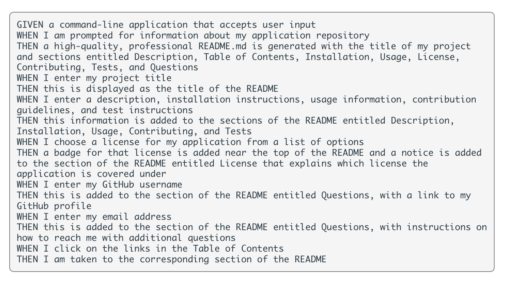
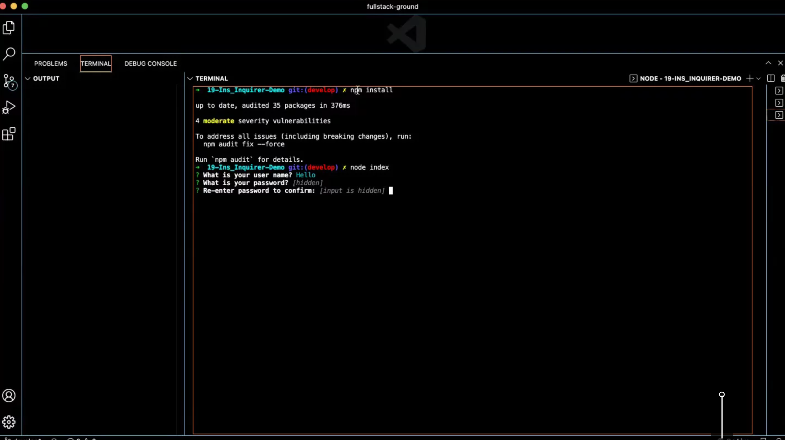

# Professional README Generator

Build a create a command-line application that dynamically generates a professional README.md file from user's input.

---

### **Steps to get started:**
```
- npm i
- node index.js
```
---

### **Application Mock Up:**




---
### **Technology used:**
```
- Javascript
- Node.js
- Inquirer package
```

---

### **Steps for future development:**
```
- successfully run generator
```